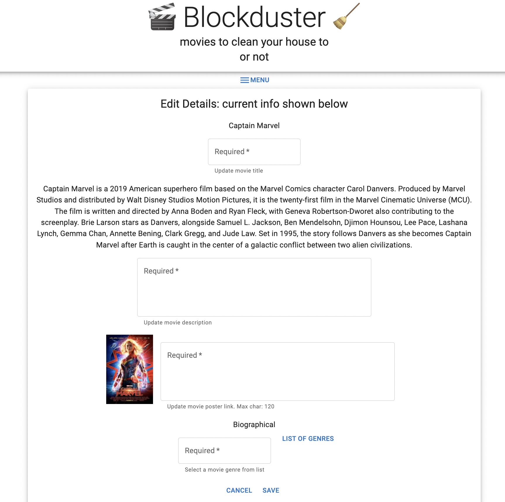
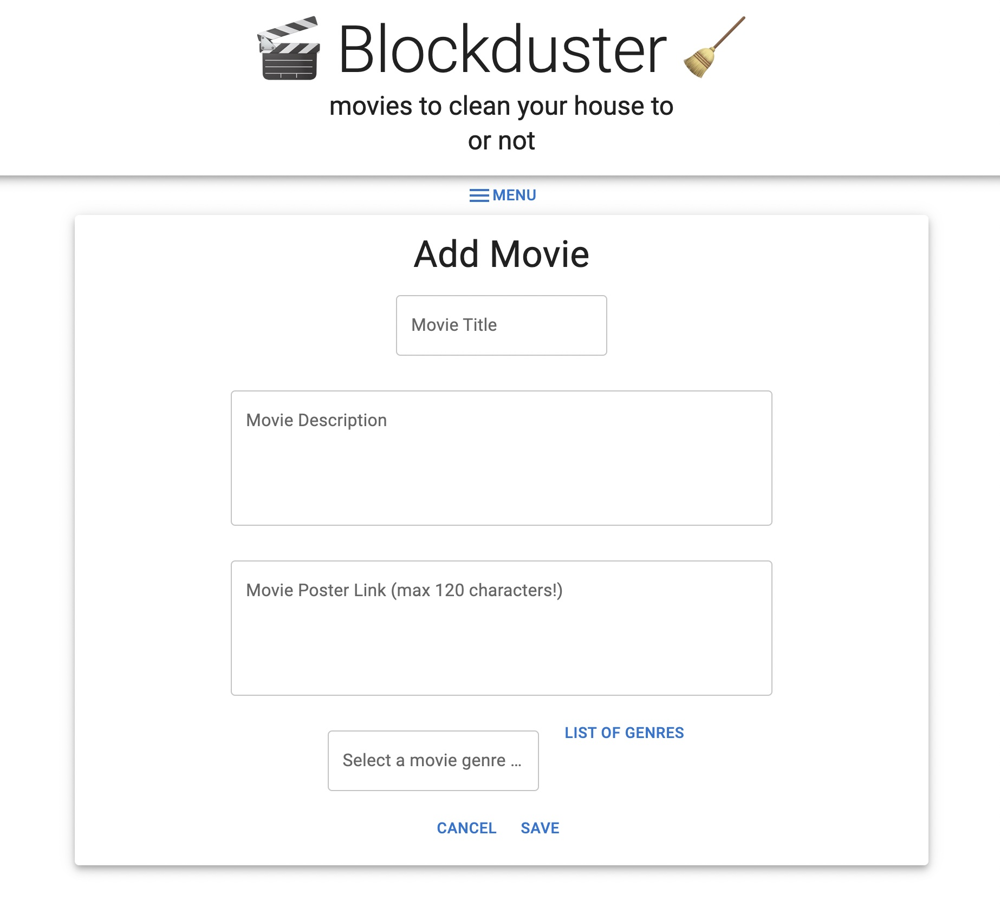

# Blockduster

## Description

_Duration: 1.5 weeks_

The feeling of sitting down on the couch on a Friday evening is wonderful. With the weekend ahead of you, it's time to sit back and watch something to wind down. 

In this moment, there is nothing worse than not knowing what to watch. You end up scrolling for ages through multiple platforms. Nothing catches your eye. Disaster!

Thankfully, Blockduster can help! Blockduster provides a platform for keeping track of movies. Whether its a film you've watched, loved, and would watch again, or if it's one you heard about and want to remember, Blockduster keeps them all in one spot!

## Screen Shots

### Prerequisites

- [Node.js](https://nodejs.org/en/)
- [nodemon](https://nodemon.io/)
- [Postgres](https://www.postgresql.org/download/)

## Installation

1. Create a database named `saga_movies_weekend`.
2. The first three queries in the `database.sql` file are set up to create the necessary tables. The last two are set up to provide starter movies to the movies table and the related data to the movies_genres junction table. The project is built on [Postgres](https://www.postgresql.org/download/), so you will need to make sure to have that installed. I recommend using [Postico](https://eggerapps.at/postico/) to run those queries as that was used to create the queries.
3. Open up your editor of choice and run an `npm install`.
4. Run `npm run server` in your terminal.
5. Run `npm run client` in your terminal.
6. The `npm run client` command will open up a new browser tab for you!

## Usage

Blockduster makes it easy to find what to watch. You can sit back and scroll through the list you've created of movie recommendations, movies you'd like to see again, and movies you know have been recently released.

When adding movies to Blockduster, you can include details like the movie genre, an image, and a description to jog your memory when scrolling through the list.

The movie details can be edited, and you can delete movies that no longer interest you. 

Take the stress out of Friday night viewing with Blockduster!

## Built With

- [Node.js](https://nodejs.org/en/)
- [nodemon](https://nodemon.io/)
- [Express](https://expressjs.com/)
- [React](https://reactjs.org/)
- [Redux](https://redux.js.org/)
- [Redux-Saga](https://redux-saga.js.org/)
- [Postgres](https://www.postgresql.org/download/)
- [Material UI](https://mui.com/)
- JavaScript
- CSS
- HTML
